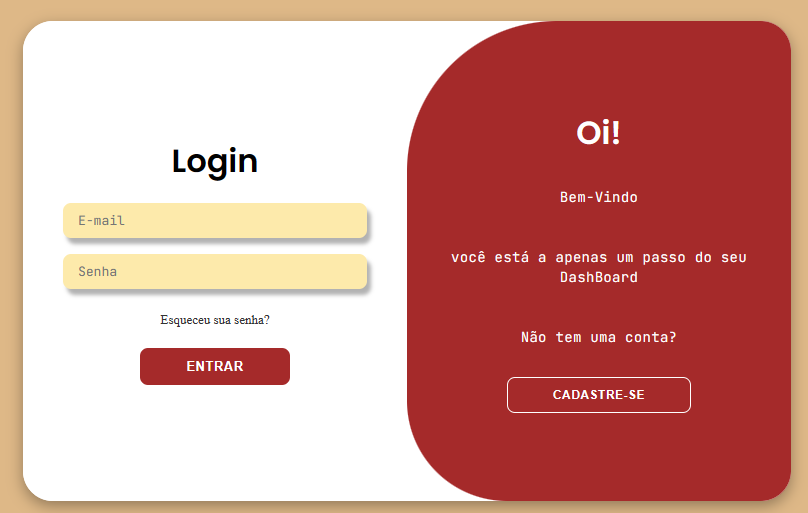
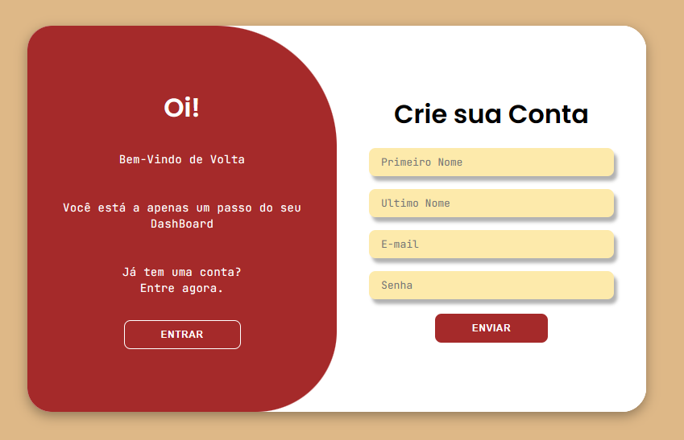
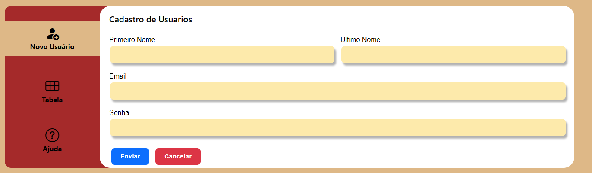
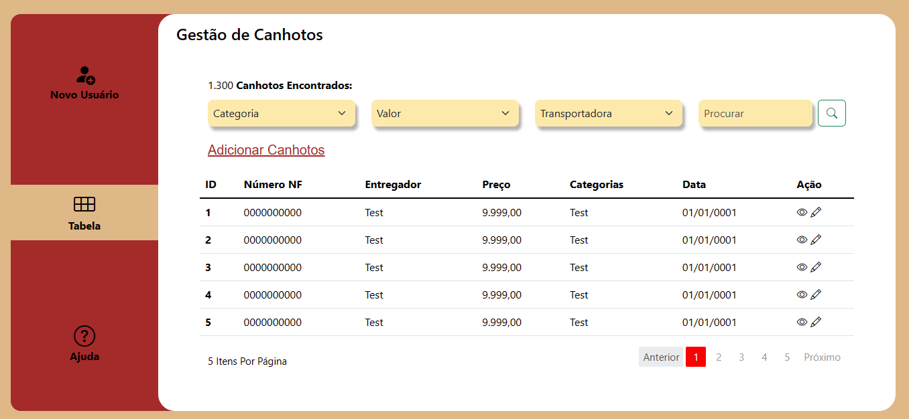
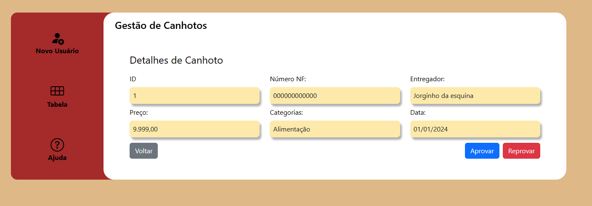
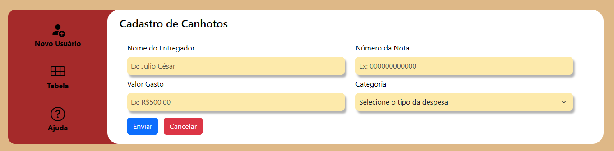

# UNIVERSIDADE DE MARÍLIA

##### Curso: Análise e Desenvolvimento de Sistemas

##### Termo: 3

##### Turma: A

 

##### Desenvolvedores:

Nome                                  | RA         
:------                               | :-------     
Cesar Augusto de Almeida              | 2009114      
Daniel Vieira					      | 1973948 
Henrique Malaga                       | 1961899       
Jean Carlos de Andrade Vieira         | 1962763       
Lucas Vilharba                        | 1979443       

 

### Gestão de Canhotos

O projeto foi desenvolvido com o objetivo de solucionar o problema de gestão de canhotos dos entregadores. Nele, os entregadores cadastram suas despesas, informando o valor, tipo de despesa e o número da nota emitida pelo estabelecimento. Os canhotos cadastrados são exibidos em uma tabela, onde há a opção de filtrar canhotos com base nos valores, tipos das despesas e transportadora.

 

### Telas

- Login e Criar conta: Nela, o usuário realiza o login ou seleciona a opção de criar conta (caso ainda não tenha uma)

 

 
 

- Cadastro dos entregadores: Nessa tela, os entregadores serão cadastrados para liberar o acesso ao cadastro de canhotos

 

 
 

- Dashboard: Página principal do projeto, onde os canhotos são exibidos em forma de tabela, é possível editar, excluir, visualizar detalhes e filtrar os mesmos de acordo com a preferência do usuário (tipo da despesa, valor, transportadora)

 

 
 

- Detalhes: Ao clicar no ícone do olho, o usuário é direcionado para uma outra tela, onde será exibido os detalhes do respectivo canhoto

 

 
 

- Adicionar canhoto: Quando há uma despesa nova a ser cadastrada, o usuário aperta em "Adicionar canhoto" no dashboard e é direcionado para essa tela, onde ele informará os dados e em seguida adicionará o novo canhoto

 

 